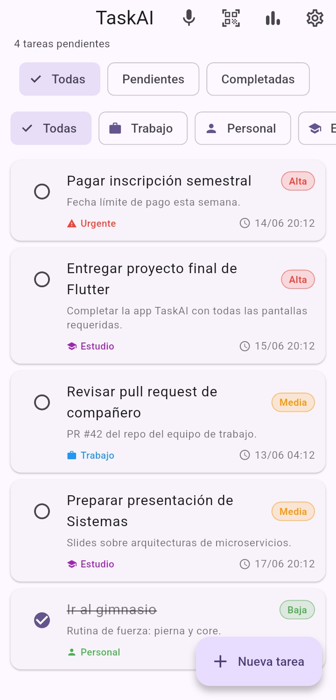
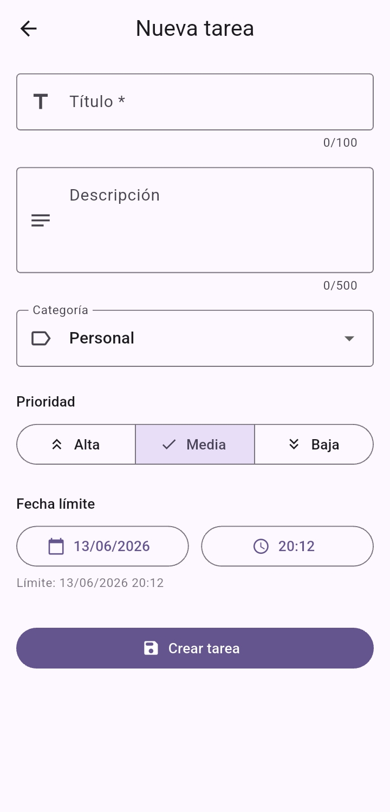
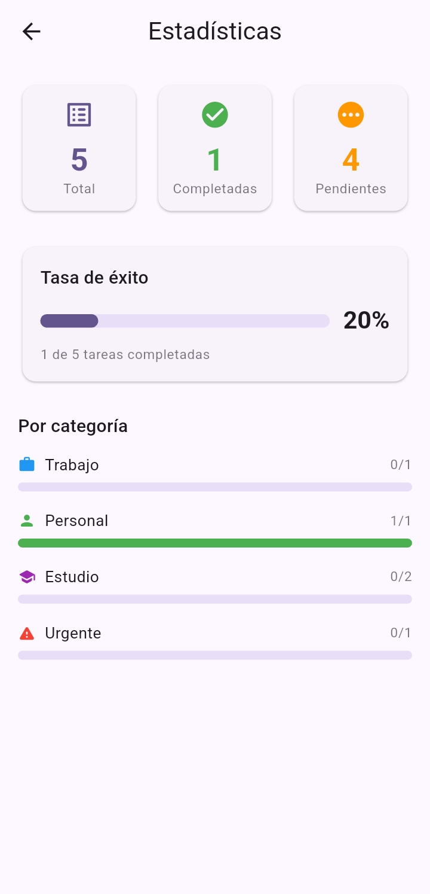
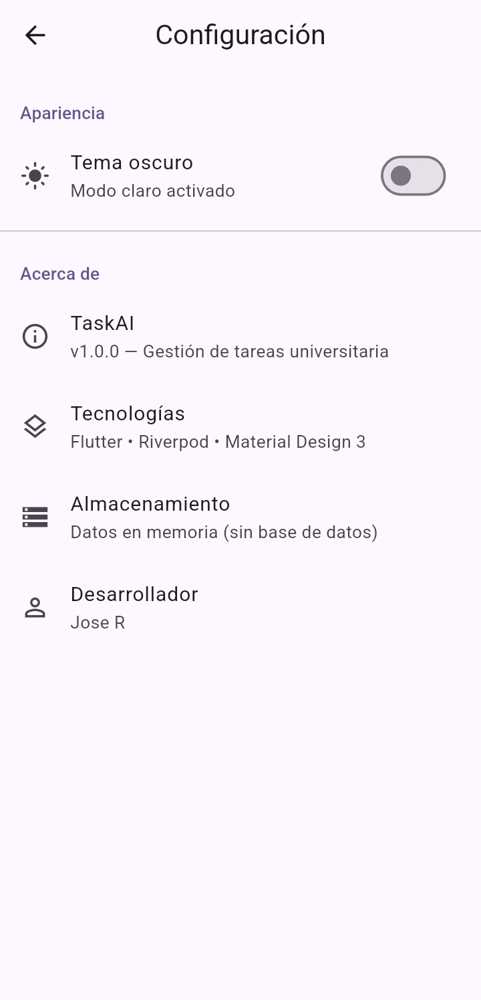

# TaskAI v2.0 — Gestión de Tareas con IA On-Device

Aplicación móvil para gestión de tareas universitaria desarrollada con Flutter. La versión 2.0 incorpora funcionalidades de inteligencia artificial completamente on-device: captura de tareas por voz y escaneo de tareas desde códigos QR.

## 📱 Capturas de pantalla

| Lista de tareas | Crear tarea |
|:---:|:---:|
|  |  |

| Estadísticas | Configuración |
|:---:|:---:|
|  |  |

## Stack técnico

| Tecnología | Versión | Uso |
|---|---|---|
| Flutter | 3.44.1+ | Framework UI |
| Dart | 3.12.1+ | Lenguaje |
| flutter_riverpod | 2.6.x | Gestión de estado |
| go_router | 15.x | Navegación |
| uuid | 4.x | Generación de IDs |
| intl | 0.20.x | Formateo de fechas |
| speech_to_text | 7.x | Reconocimiento de voz on-device |
| google_mlkit_barcode_scanning | 0.12.x | Escaneo QR con ML Kit |
| camera | 0.11.x | Acceso a cámara en tiempo real |
| flutter_secure_storage | 9.x | Almacenamiento seguro de metadatos |
| permission_handler | 11.x | Gestión de permisos en runtime |
| Material Design 3 | — | Sistema de diseño |

## Requisitos previos

- Flutter 3.38 o superior
- Dart 3.x
- Android SDK 21+ (requerido por ML Kit)
- Dispositivo Android físico o emulador con cámara y micrófono

## Instrucciones de instalación

```bash
# 1. Clonar el repositorio
git clone https://github.com/JA-Rodriguez-Ozuna/Desarrollo_aplicaciones_moviles_taskAI.git
cd Desarrollo_aplicaciones_moviles_taskAI/task_ai

# 2. Instalar dependencias
flutter pub get

# 3. Verificar dispositivos disponibles
flutter devices

# 4. Ejecutar la app
flutter run

# 5. Para construir APK de debug
flutter build apk --debug
```

## Pantallas

### v1.0 — Pantallas base

#### HomeScreen (`/`)
Lista principal de tareas con:
- Filtros por estado: Todas / Pendientes / Completadas
- Filtros por categoría: Trabajo / Personal / Estudio / Urgente
- Tarjetas con prioridad, categoría y fecha límite
- Swipe-to-delete con confirmación y opción "Deshacer"
- Accesos directos a Voz y QR en el AppBar
- FAB para crear nueva tarea manualmente

#### TaskFormScreen (`/task/new` y `/task/edit/:id`)
Formulario para crear y editar tareas:
- Campo título (requerido, máx. 100 caracteres)
- Campo descripción (opcional, máx. 500 caracteres)
- DropdownButton para categoría
- SegmentedButton MD3 para prioridad (Alta / Media / Baja)
- Date picker y Time picker para fecha límite
- Validaciones: título requerido, fecha no en el pasado

#### StatisticsScreen (`/statistics`)
Panel de estadísticas con contadores y progreso por categoría.

#### SettingsScreen (`/settings`)
Toggle de tema claro/oscuro y metainformación de la app.

### v2.0 — Funcionalidades de IA

#### VoiceScreen (`/voice`)
Captura de tareas mediante reconocimiento de voz on-device:
- Procesamiento 100% local — sin envío de audio a servidores
- Animación de pulso mientras escucha
- Transcripción en tiempo real con visualización del texto
- Botón para detener y reiniciar la captura
- Convierte automáticamente el texto transcrito en tarea:
  - **Título**: primeras 6 palabras del texto
  - **Descripción**: texto completo transcrito
- Manejo de permiso de micrófono con feedback visual
- Manejo de dispositivos sin soporte de voz

#### QRScanScreen (`/qr-scan`)
Escaneo de tareas desde códigos QR on-device:
- Procesamiento 100% local con Google ML Kit
- Visor en tiempo real con overlay de marco de escaneo
- Formato de QR esperado (JSON):
  ```json
  {"title":"Entregar informe","description":"Grupo 3","category":"estudio","priority":"alta"}
  ```
- Vista previa de la tarea antes de confirmar la creación
- El usuario confirma o cancela antes de guardar
- Manejo de permiso de cámara con diálogo para ir a Configuración
- Manejo robusto de QR con JSON inválido o campos faltantes

## Servicios

### PermissionService (`lib/services/permission_service.dart`)
Gestiona los permisos de micrófono y cámara:
- Si se deniega: muestra SnackBar con explicación
- Si se deniega permanentemente: muestra diálogo con botón a Configuración del sistema

### SecureStorageService (`lib/services/secure_storage_service.dart`)
Almacenamiento cifrado de metadatos de configuración del usuario:
- API: `saveValue(key, value)`, `getValue(key)`, `deleteValue(key)`
- Guarda timestamps de última captura por voz y último escaneo QR
- No almacena tareas (siguen en memoria)

## Modelo de datos

```dart
class Task {
  String id;             // UUID v4
  String title;          // Requerido
  String description;    // Opcional
  TaskCategory category; // trabajo | personal | estudio | urgente
  TaskPriority priority; // alta | media | baja
  DateTime dueDate;
  bool isCompleted;
  DateTime createdAt;
}
```

## Estructura del proyecto

```
lib/
├── main.dart
├── router/
│   └── app_router.dart          # go_router — 7 rutas + 404
├── theme/
│   └── app_theme.dart           # Tema MD3 púrpura, claro/oscuro
├── models/
│   └── task.dart                # Modelo + enums + copyWith/toMap/fromMap
├── providers/
│   └── task_provider.dart       # Riverpod StateNotifier + filtros
├── services/
│   ├── permission_service.dart  # Gestión de permisos (micrófono, cámara)
│   └── secure_storage_service.dart # Almacenamiento cifrado
├── screens/
│   ├── home_screen.dart         # Lista + accesos a Voz y QR
│   ├── task_form_screen.dart
│   ├── statistics_screen.dart
│   ├── settings_screen.dart
│   ├── voice_screen.dart        # [NUEVO v2.0] Captura por voz
│   └── qr_scan_screen.dart      # [NUEVO v2.0] Escáner QR
└── widgets/
    ├── task_card.dart
    ├── filter_chips.dart
    └── stats_card.dart
```

## Configuración nativa Android

| Parámetro | Valor |
|---|---|
| minSdkVersion | 21 (requerido por ML Kit) |
| compileSdkVersion | 34 |
| Permisos | `RECORD_AUDIO`, `CAMERA` |

---

Proyecto académico — Desarrollo de Aplicaciones Móviles  
Universidad Iberoamericana
